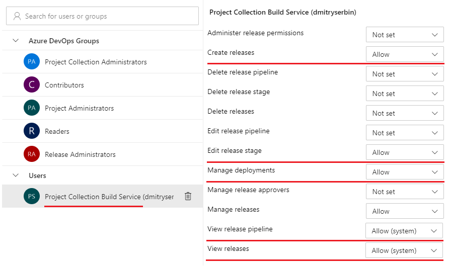
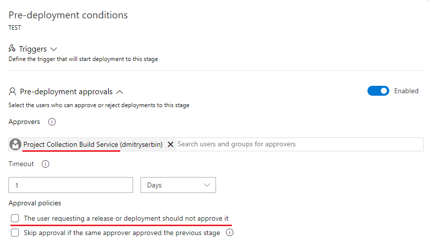

# Release Orchestrator

- [Overview](#Overview)
- [Features](#Features)
- [Prerequisites](#Prerequisites)
- [How To Use](#How-To-Use)
- [Support](#Support)

## Overview

The **Release Orchestrator** [extension](https://marketplace.visualstudio.com/items?itemName=dmitryserbin.release-orchestrator) adds a task to easily execute and track progress of multiple release pipelines in Azure DevOps. You can use this task to orchestrate numerous pipelines and deploy microservices components in a specific order.

Build | Extension
:------|:-------
 | 

## Features

The **Release Orchestrator** task performing Azure DevOps release pipeline execution and provides various customization settings.

It uses either **integrated** (SystemVssConnection) or **user-defined**  personal access token (PAT) Azure DevOps service endpoint to connect to projects' pipelines.

- Create new, deploy latest release or specific release
- Target specific release deployment stages
- Apply release deployment filters
- Track release progress and display results

## Prerequisites

To perform release pipeline orchestration the task requires Azure DevOps service endpoint with specific access to target project' pipelines to be able to create and manage releases.

There are two types of Azure DevOps **service endoints** supported:

Type | Name | Account
---- | ---- | -------
integrated | SystemVssConnection | Project Collection Build Service
specific | User specified | User specified

You may need to check and update the following settings in Azure DevOps to utilize full potential of Release Orchestrator.

- Service endpoint pipelines permissions
- Deployment appoval gates configuration

#### Service endpoint permissions

In release pipelines security section of Azure DevOps project allow the following access to user account of the service endpoint:

- Create releases
- Edit release stage
- Manage deployments
- View release pipeline
- View releases

Please refer to Azure DevOps [permissions and security roles documentation](https://docs.microsoft.com/en-us/azure/devops/pipelines/policies/permissions) for more details.

#### Approval gates configuration

The task can automate release stage pre-deployment approval, in order to configure it you need:

- Add Azure DevOps service endpoint user account to stage approvers
- Uncheck 'The user requesting a release or deployment should not approve it' checkbox.

In case service endpoint user is not in the approval list or is not allowed to approve the release, manual approval is required and a warning is displayed in the release pipeline progress.

Please refer to Azure DevOps [approvals and gates documentation](https://docs.microsoft.com/en-us/azure/devops/pipelines/release/approvals) for more details.

## How To Use

1. Add **Release Orchestrator** task to your release pipeline
2. Select 'Integrated Endpoint' or 'Service Endpoint' endpoint type
3. Select target project and release definition

> You may need to create a new Azure Pipelines [service connection](https://docs.microsoft.com/en-us/azure/devops/pipelines/library/service-endpoints) using [PAT](https://docs.microsoft.com/en-us/azure/devops/organizations/accounts/use-personal-access-tokens-to-authenticate) token.

## Release Strategy

You can choose different strategy for orchestrator to perform target release deployment:

- Create new release - find target release definition and create new release
- Deploy latest available release - find and re-deploy latest active release from release definition
- Deploy specific release - find and re-deploy specific release from release definition

### Create Release

- Definition Stages: target specific deployment stage(s) (comma separated) (optional)
- Filter Artifact Tag: enable new release filtering by primary build artifact tag (optional)
- Filter Source Branch: enable new release filtering by primary artifact source branch name (optional)

### Latest Release

- Release Stages: specify release deployment stage(s) (comma separated)
- Filter Release Tag: enable filtering target release by release pipeline tag (optional)
- Filter Artifact Tag: enable filtering target release by primary build artifact tag (optional)
- Filter Source Branch: enable filtering target release by primary artifact source branch name (optional)

### Specific Release

- Release Name: select existing release to target (or specify release ID)
- Release Stages: specify release deployment stage(s) (comma separated)

## Support

For aditional information and support please refer to [project repository](https://github.com/dmitryserbin/azdev-release-orchestrator). For help with Azure DevOps and release pipelines please refer to [official documentation](https://docs.microsoft.com/en-us/azure/devops).